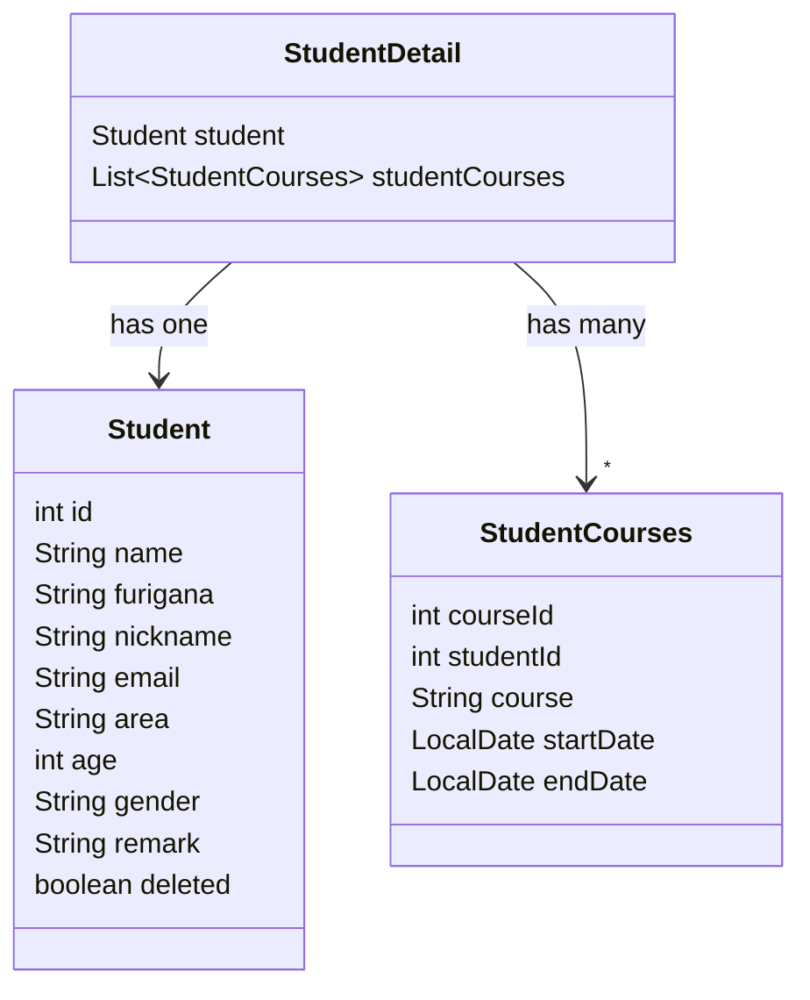

# プログラミングスクール受講生管理アプリ

プログラミングスクールでの受講生のプロフィール情報と受講コースの状況を管理するアプリケーションです。

## 制作背景

本アプリケーションは、Web開発の学習に加えて、**業務品質を意識したテスト設計**
に重点を置いて開発しました。  
コントローラー層とサービス層に対して単体テストとバリデーションテストを実装し、正常系・異常系双方の動作確認を徹底しています。

特に以下の観点を重視しました：

- パラメータ化テストによる効率的かつ網羅的な入力検証
- バリデーションエラーとリクエストエラーの分類による明確な責務分離
- mockを活用した依存処理の呼び出し回数と引数の検証
- APIレスポンスを画面キャプチャと併せて可視化

テスト設計・実装を通じて、**品質の高いアプリケーション構築**を目指しました。

## 概要

### 使用技術

***

- Java 21
- Spring Boot
- Thymeleaf
- MySQL
- Lombok
- JUnit

### 機能一覧

***

|   | 機能         |
|---|------------|
| 1 | 受講生情報の登録機能 |
| 2 | コース情報の登録機能 |
| 3 | 受講生情報の更新機能 |
| 4 | コース情報の更新機能 |
| 5 | 受講生情報の検索機能 |
| 6 | コース情報の検索機能 |

## テスト

以下にコントローラーとサービスのテストを記載します。

### StudentControllerTest

<details><summary> バリデーションテスト表</summary>

|               テスト内容                |           検証内容           |
|:----------------------------------:|:------------------------:|
|      受講生詳細の受講生で入力チェックに異常がないこと      |  バリデーションルール<br>エラーがないこと  | 
|  受講生詳細の受講生で入力チェックに異常メッセージが返ってくること  | バリデーションルール<br>エラーメッセージ内容 | 
|     受講生詳細のコース情報の入力チェックに異常がないこと     |  バリデーションルール<br>エラーがないこと  | 
| 受講生詳細のコース情報で入力チェックに異常メッセージが返ってくること | バリデーションルール<br>エラーメッセージ内容 | 

</details>

<details><summary> 正常動作テスト表</summary>

|            テスト内容             |                             検証内容                              |
|:----------------------------:|:-------------------------------------------------------------:|
|  受講生一覧検索が実行できて空のリストが返ってくること  |  レスポンスが200 OKであること<br>受講生一覧検索メソッドが1回実行されること<br>空のリストが返ってくること  | 
|  コース情報検索が実行できて空のリストが返ってくること  |    レスポンスが200 OKであること<br>コース情報検索が1回実行されること<br>空のリストが返ってくること    | 
|   受講生登録が実行できてレスポンスが返ってくること   |      レスポンスが200 OKであること<br>受講生登録メソッドが1回実行されること<br>メッセージ内容      | 
|  コース情報登録が実行できてレスポンスが返ってくること  |     レスポンスが200 OKであること<br>コース情報登録メソッドが1回実行されること<br>メッセージ内容     | 
|  受講生ID検索が実行できてレスポンスが返ってくること  |  レスポンスが200 OKであること<br>受講生ID検索メソッドが1回実行されること<br>受講生情報が返ってくること  | 
| 受講生情報の更新が実行できてレスポンスが返ってくること  |     レスポンスが200 OKであること<br>受講生情報更新メソッドが1回実行されること<br>メッセージ内容     | 
| コース情報ID検索が実行できてレスポンスが返ってくること | レスポンスが200 OKであること<br>コース情報ID検索メソッドが1回実行されること<br>コース情報が返ってくること | 
| コース情報の更新が実行できてレスポンスが返ってくること  |     レスポンスが200 OKであること<br>コース情報更新メソッドが1回実行されること<br>メッセージ内容     | 

</details>

<details><summary> エラー動作テスト表</summary>

|                テスト内容                 |                              検証内容                              |
|:------------------------------------:|:--------------------------------------------------------------:|
| 受講生情報の更新で誤ったidを入力したらエラーメッセージが返ってくること |      レスポンスが200 OKであること<br>受講生情報更新メソッドが実行されないこと<br>メッセージ内容      | 
| コース情報の更新で誤ったidを入力したらエラーメッセージが返ってくること |        レスポンスが200 OKであること<br>コース情報更新が実行されないこと<br>メッセージ内容        | 
|  受講生情報の名前にエラーがありBadRequestが返ってくること   |        レスポンスが400 BadRequestであること<br>受講生登録メソッドが実行されないこと         | 
|  受講生ID検索で誤ったIDを渡してエラーメッセージが返ってくること   |  レスポンスが400 BadRequestであること<br>受講生ID検索メソッドが実行されないこと<br>メッセージ内容  | 
| コース情報ID検索で誤ったIDを渡してエラーメッセージが返ってくること  | レスポンスが400 BadRequestであること<br>コース情報ID検索メソッドが実行されないこと<br>メッセージ内容 | 

</details>

### StudentServiceTest

<details><summary> サービステスト表</summary>

|                  テスト内容                  |                    検証内容                     |
|:---------------------------------------:|:-------------------------------------------:|
| 受講生詳細の一覧検索_リポジトリとコンバーターの処理が適切に呼び出せていること | 各メソッドが1回ずつ実行されること<br>SUTとコンバーターの結果が一致していること | 
|    コース情報一覧検索_リポジトリの処理が適切に呼び出されていること     |  メソッドが1回実行されること<br>SUTとリポジトリの返却値が一致していること   | 
|   受講生詳細情報のID検索_リポジトリの処理が適切に呼び出されていること   |   各メソッドが1回ずつ実行されること<br>SUTが指定の値と一致していること    | 
|    コース情報ID検索_リポジトリの処理が適切に呼び出されていること     |  メソッドが1回実行されること<br>SUTとリポジトリの返却値が一致していること   | 
|     受講生情報の登録_リポジトリの処理が適切に呼び出されていること     |               メソッドが1回実行されること                | 
|     コース情報の登録_リポジトリの処理が適切に呼び出されていること     |               メソッドが1回実行されること                |
|     受講生情報の更新_リポジトリの処理が適切に呼び出されていること     |               メソッドが1回実行されること                |
|     コース情報の更新_リポジトリの処理が適切に呼び出されていること     |               メソッドが1回実行されること                |

</details>

### 工夫したこと

***

1. @ParameterizedTestによるテスト効率化
   正常系と異常系の入力データをStreamで管理し、パラメータ化テストにより複数ケースを一括検証できるようにしました。  
   テストデータの重複記述を避け、メンテナンス性と可読性の向上を図っています。

- 正常データ作成

```java
    static Stream<Arguments> validStudentData() {
  return Stream.of(
      Arguments.of(Student.builder()
          .id(1).name("佐藤太郎").furigana("さとうたろう")
          .email("taro@gmail.com").area("東京都").age(22).gender("男")
          .build()
      )
  );
}
```

- 異常データ作成

```java
    static Stream<Arguments> invalidStudentData() {
  return Stream.of(
      Arguments.of(Student.builder()
          .id(1).furigana("さとうたろう")
          .email("taro@gmail.com").area("東京都").age(22).gender("男")
          .build(), List.of("名前を入力してください")),
      Arguments.of(Student.builder()
          .id(1).name("a").furigana("さとうたろう")
          .email("taro@gmail.com").area("東京都").age(22).gender("男")
          .build(), List.of("2文字以上50文字以下で入力してください")),
      Arguments.of(Student.builder()
          .id(1).name("佐藤太郎").furigana("さとうたろう")
          .area("東京都").age(22).gender("男")
          .build(), List.of("メールアドレスを入力してください"))
  );
}
```

2. バリデーションエラーとリクエストエラーの責務分離
   異常系の動作確認において、入力値のバリデーションエラーとリクエストエラーを分類しました。  
   テストの意図を把握しやすくし、漏れのない網羅性のある検証設計を目指しました。

- バリデーションエラー時のテスト

```java
    static Stream<Arguments> invalidStudentCourseData() {
  return Stream.of(
      Arguments.of(StudentCourses.builder()
          .courseId(1).studentId(1)
          .build(), List.of("コース名を入力してください")),
      Arguments.of(StudentCourses.builder()
          .courseId(1).studentId(1).course("abcd-abcd-abcd-abcd-a")
          .build(), List.of("1文字以上20文字以下で入力してください"))
  );
}
```

- 不正リクエストテスト

```java

@Test
void コース情報ID検索で誤ったIDを渡してエラーメッセージが返ってくること() throws Exception {
  int errId = 0;

  mockMvc.perform(MockMvcRequestBuilders.get("/student/course/{id}", errId))
      .andExpect(status().isBadRequest())
      .andExpect(content().string("リクエストが不正です"));

  verify(service, times(0)).searchCourses(errId);
}
```

## 付録

### APIレスポンス

***
本アプリケーションのAPIレスポンスです。

1. 受講生登録

2. コース情報登録

3. 受講生一覧検索
   

4. 受講生ID検索
   

5. コース情報一覧検索
   

6. コース情報ID検索
   

7. 受講生情報更新

- 更新成功
  
- 更新されたかの確認
  

8. コース情報更新

- 更新成功
  
- 更新されたかの確認
  

9. 不正なリクエスト時のメッセージ

- 受講生情報更新時のIDが不正
  
- 存在しないIDの検索
  

### ER図

***

