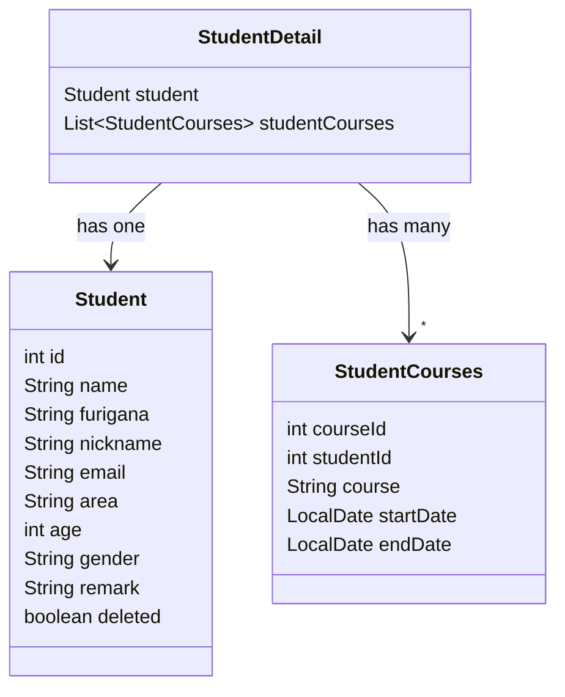

```mermaid
classDiagram
    class Student {
        int id
        String name
        String furigana
        String nickname
        String email
        String area
        int age
        String gender
        String remark
        boolean deleted
    }

    class StudentCourses {
        int courseId
        int studentId
        String course
        LocalDate startDate
        LocalDate endDate
    }

    class StudentDetail {
        Student student
        List~StudentCourses~ studentCourses
    }

    StudentDetail --> Student: has one
    StudentDetail --> "*" StudentCourses: has many

```
